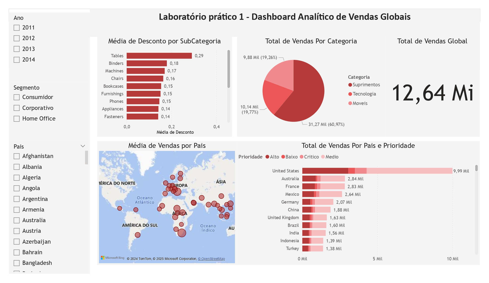

# 📊 Dashboard Analítico de Vendas Globais

**Ferramenta:** Power BI  
**Objetivo:** Analisar o desempenho global de vendas, identificando padrões de consumo por categoria de produto, país e prioridade de mercado.

---

## 🖼️ Visualização do Dashboard

---

## 📝 Descrição

Desenvolvi um dashboard interativo para monitorar e analisar as vendas globais de uma empresa. A solução permite uma visão detalhada sobre o desempenho por categoria de produto, subcategoria, país e prioridade.

---

## 🔎 Principais Funcionalidades

- **Filtros Dinâmicos:** Segmentação de dados por ano, tipo de cliente e país.  
- **Análise de Descontos:** Visualização da média de descontos aplicados por subcategoria de produto.  
- **Distribuição de Vendas por Categoria:** Gráfico de pizza destacando a participação de cada categoria (Móveis, Tecnologia e Suprimentos) no total de vendas.  
- **Indicador de Vendas Globais:** Apresentação do total de vendas acumulado (R$ 12,64 Mi).  
- **Mapa Interativo:** Distribuição geográfica das vendas por país, facilitando a identificação de mercados estratégicos.  
- **Análise por Prioridade:** Gráfico de barras detalhando o total de vendas por país, segmentado por prioridade (Alto, Baixo, Crítico, Médio).  

---

## 💡 Principais Insights

- A categoria **Móveis** representa a maior parte das vendas globais (**60,97%**).  
- **Estados Unidos** são o maior mercado consumidor, seguido por **Austrália** e **França**.  
- A subcategoria **Mesas (Tables)** recebe os maiores descontos médios (**0,29**), sugerindo potencial ajuste de pricing.  

---

## 🎯 Resultados Esperados

- Melhor tomada de decisão estratégica com base em dados de vendas.  
- Identificação de oportunidades de crescimento em mercados com alta prioridade.  
- Ajuste de políticas de desconto para maximizar lucro e competitividade.  

---

## 📂 Como Visualizar o Dashboard

1. Baixe o arquivo `.pbix` disponível na pasta deste projeto.  
2. Abra o arquivo no **Power BI Desktop**.  
3. Interaja com os filtros e gráficos para explorar os dados.  
**[pbix](../Pbix/Lab1.pbix)**
---

🔗 **[Voltar ao Portfólio](../README.md)**
