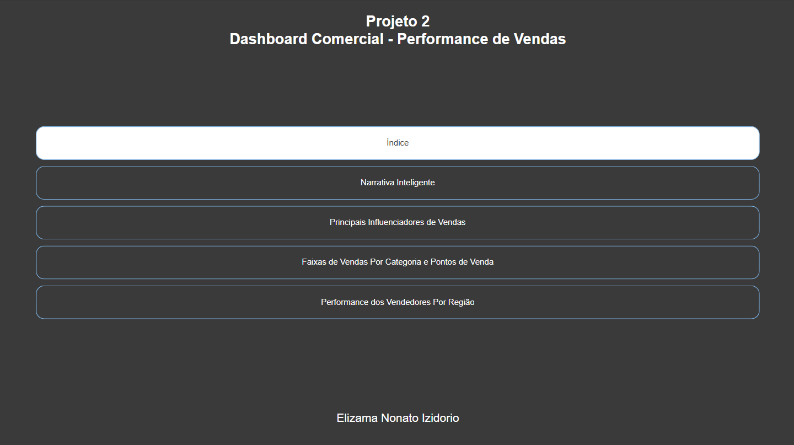

# 🛍️ Dashboard de Análise de Vendas e Segmentação de Clientes - Mini Projeto 2

**Ferramenta:** Power BI  
**Objetivo:** Fornecer uma visão estratégica sobre o comportamento de vendas e segmentação de clientes, considerando variáveis como categoria de produto, mercado, envio e rentabilidade.

---

## 🖼️ Visualização do Dashboard

---

## 📝 Descrição

O Mini Projeto 2 apresenta um dashboard desenvolvido para analisar dados de vendas, lucro e comportamento do cliente. A solução oferece uma visualização clara de KPIs, margens de lucro ao longo do tempo e custos de envio por região, permitindo a identificação de padrões e pontos de melhoria nos processos de vendas e distribuição.

---

## 🔎 Principais Funcionalidades

- **Lucro por Categoria:** Gráfico em rosca que mostra a participação de cada categoria (Tecnologia, Móveis e Escritório) no lucro total.  
- **Total de Vendas por Modo de Envio:** Gráfico de barras que compara os valores de vendas com base nos tipos de envio (Classe Padrão, Segunda Classe, Primeira Classe, Mesmo Dia).  
- **KPI de Valor Médio de Venda:** Indicador que mostra a média geral de vendas com escala comparativa.  
- **Análise de Custo de Envio por Mercado:** Treemap que mostra o custo médio de envio por região (APAC, LATAM, EMEA, etc).  
- **Evolução da Margem de Lucro:** Gráfico de linha que demonstra a variação mensal da margem de lucro ao longo do tempo.  
- **Filtro Temporal:** Segmentação por ano e mês para refinar a análise temporal.

---

## 💡 Principais Insights

- A categoria **Material de Escritório** representa a maior fatia de lucro (**46,55%**), superando Móveis e Tecnologia.  
- O modo de envio mais utilizado e lucrativo é a **Classe Padrão**.  
- A margem de lucro mostra variações sazonais, com picos notáveis ao longo dos anos.  
- **Regiões como APAC e EUA** têm os maiores custos médios de envio, impactando a rentabilidade.  

---

## 🎯 Resultados Esperados

- Apoiar decisões sobre logística e tipos de envio mais vantajosos.  
- Identificar mercados com altos custos operacionais para possíveis reestruturações.  
- Monitorar a rentabilidade por produto e por canal de envio.  
- Compreender a evolução do desempenho financeiro com base no tempo.

---

## 📂 Como Visualizar o Dashboard

1. Faça o download do arquivo `.pbix` disponível neste projeto.  
2. Abra no **Power BI Desktop**.  
3. Explore os filtros interativos e gráficos para obter insights personalizados.
**[pbix](../Pbix/Mini-Projeto2-Eliz.pbix)**

---

🔗 **[Voltar ao Portfólio](../README.md)**
